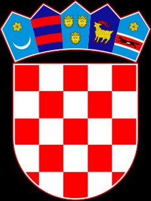
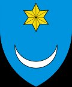
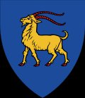
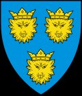
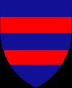

  

<h1 align="center">🇭🇷 Croatia: A Complete Travel Guide</h1>

<i>My Personal Recommendations & Curated Travel Guide</i>

<b>By Niko Zivanovich</b>

📌 = My personal Google Maps saves · 🍷 = Anthony Bourdain priority picks

---

## 📋 Contents

**Northern Croatia**
- [Zagreb & Continental Croatia](#sec-zagreb)
- [Istria Peninsula](#sec-istria)
- [Kvarner Gulf](#sec-kvarner)

**Dalmatia**
- [Northern Dalmatia — Zadar, Šibenik & Plitvice Lakes](#sec-ndalmatia)
- [Central Dalmatia — Split, Hvar, Korčula, Brač & Vis](#sec-cdalmatia)
- [Southern Dalmatia — Dubrovnik, Pelješac & the Islands](#sec-sdalmatia)

**General Tips & Bourdain Route**
- [General Croatia Travel Tips](#sec-tips)
- [🍷 The Bourdain Route](#sec-bourdain)

---

##  Zagreb & Continental Croatia

*Capital city culture, Plitvice Lakes & the continental interior. I recommend starting your Croatia trip by flying into Zagreb — it's the best option for convenience and cost. There isn't too much to see here, so I would drive straight to Plitvice from here.*

### 📌 My Picks

> **📌 MY PICKS**

*No personal Google Maps saves for this region — expert recommendations below.*

### Attractions

### City Highlights

- **Upper Town (Gornji Grad)** — Medieval cobblestone streets, funicular ride, St. Mark's Church with iconic tiled roof [\[Google Maps\]](https://www.google.com/maps/search/Upper+Town+Gornji+Grad+Zagreb+Croatia) *\[Lonely Planet\]*

- **Museum of Broken Relationships** — Zagreb's most beloved and unusual museum — a global cultural phenomenon [\[Google Maps\]](https://www.google.com/maps/search/Museum+of+Broken+Relationships+Zagreb) *\[Fodor's · Lonely Planet\]*

- **Museum of Contemporary Art** — Top cultural pick for Zagreb [\[Google Maps\]](https://www.google.com/maps/search/Museum+of+Contemporary+Art+Zagreb) *\[Fodor's\]*

- **Varaždin** — Baroque "little Vienna" — an easy day trip from Zagreb [\[Google Maps\]](https://www.google.com/maps/search/Varazdin+Croatia) *\[Fodor's\]*

### Day Trips from Zagreb

- **Plitvice Lakes National Park** — UNESCO World Heritage Site. 16 interconnected lakes, countless waterfalls, boardwalk hiking through beech forest. One of Europe's most spectacular natural wonders. Plan two days: Upper Lakes afternoon + Lower Lakes morning. One day should be good for exploring, then you can drive to Zadar and stay the night there. [\[Google Maps\]](https://www.google.com/maps/search/Plitvice+Lakes+National+Park+Croatia) *\[Rick Steves ★★★\]*

- **Kopački Rit Nature Park** — One of Europe's largest natural wetlands — ~300 bird species including white-tailed eagles. Boat trips available. [\[Google Maps\]](https://www.google.com/maps/search/Kopacki+Rit+Nature+Park+Croatia) *\[Lonely Planet\]*

### Travel Tips

- Allow 1–2 nights in Zagreb to decompress before the coast — architecture and café culture rival a smaller Prague *\[Rick Steves\]*

- The specialty coffee scene is genuinely excellent — Lonely Planet calls it one of Croatia's underrated highlights *\[Lonely Planet\]*

- For Plitvice: visit Upper Lakes in the afternoon, Lower Lakes the following morning for the best light and fewest crowds *\[Rick Steves\]*

- Use Zagreb airport as your entry/exit point — strongest European flight connections in the country

##  Istria Peninsula

*Croatia's Italian corner — truffles, seafood, hilltop towns & Adriatic coastline*

### 📌 My Picks

*No personal Google Maps saves for Istria — expert recommendations and Bourdain priorities below.*

### Restaurants & Food

- **Rovinj waterfront dining** — Rick Steves' favourite Istrian coastal stop — seafood-forward restaurants line the waterfront below the hilltop church *\[Rick Steves\]*

- **Malvazija & Teran wines** — The two signature Istrian wines — order them everywhere. Malvazija is the white; Teran the red. *\[Fodor's\]*

- **White truffles** — Shaved generously on fuži or pljukanci pasta — now \$200+/oz but worth it. Motovun/Livade are the epicentre.

<table>
<colgroup>
<col style="width: 100%" />
</colgroup>
<tbody>
<tr class="odd">
<td>
<strong>🍷 BOURDAIN PRIORITY</strong>

<ul>
<li>
<strong>Konoba Mondo</strong> — Barbican ul. 1, Motovun <em>The truffle restaurant from the No Reservations episode. Full truffle menu in season. Order: fuži with white truffles, fritaja with truffles and sausage.</em> <a href="https://www.google.com/maps/search/Konoba+Mondo+Motovun">[Google Maps]</a>
</li>
<li>
<strong>Konoba Batelina</strong> — Banjole, near Pula <em>"Trash fish" tasting menu — bonito roulade, monkfish tripe, shark liver with onions. Call ahead; trust the kitchen entirely.</em> <a href="https://www.google.com/maps/search/Konoba+Batelina+Banjole">[Google Maps]</a>
</li>
<li>
<strong>Lim Bay oyster &amp; mussel experience</strong> — Fjord inlet north of Rovinj <em>Where Bourdain opened the episode. Look for informal shellfish spots along the fjord. Raw oysters with grappa.</em>
</li>
</ul></td>
</tr>
</tbody>
</table>

### Attractions

- **Rovinj** — Rick Steves' top Istrian coastal pick — pastel facades, cobblestone lanes, hilltop Church of St. Euphemia. "The town rises dramatically from the Adriatic." [\[Google Maps\]](https://www.google.com/maps/search/Rovinj+Croatia) *\[Rick Steves\]*

- **Pula Roman Amphitheater** — 6th-largest surviving Roman amphitheater in the world, remarkably preserved. Also: Temple of Augustus and Arch of the Sergii. [\[Google Maps\]](https://www.google.com/maps/search/Pula+Arena+Roman+Amphitheater+Croatia) *\[Lonely Planet\]*

- **Motovun** — Hilltop truffle town with panoramic vineyard views. Walk the medieval ramparts. Bourdain called it "Truffle Town." [\[Google Maps\]](https://www.google.com/maps/search/Motovun+Croatia)

- **Cape Kamenjak** — Undeveloped nature reserve on Istria's southern tip — pebble bays and rocky beaches, almost no crowds [\[Google Maps\]](https://www.google.com/maps/search/Lokrum+Island+Dubrovnik) [\[Google Maps\]](https://www.google.com/maps/search/Cape+Kamenjak+Croatia) *\[Lonely Planet\]*

- **Lim Bay** — Fjord-like inlet: oyster and mussel waters, dramatic coastal scenery. Bourdain priority. [\[Google Maps\]](https://www.google.com/maps/search/Lim+Bay+Croatia)

### Travel Tips

- Base yourself in central Istria for easy reach of both coast and interior *\[Lonely Planet\]*

- White truffles peak October–December; black truffles available year-round

- Pula amphitheater crowds with cruise ships around 9am — visit early or late afternoon *\[Rick Steves\]*

- The Motovun square is ideal for al fresco dinner at dusk; arrive before sunset for the best vineyard panorama *\[Rick Steves\]*

- Istria can be combined with Kvarner on a northern Croatia itinerary, then down the coast to Split and Dubrovnik

##  Kvarner Gulf

*Habsburg elegance, accessible islands & the gateway between Istria and Dalmatia*

### 📌 My Picks

*No personal Google Maps saves for Kvarner — expert recommendations below.*

### Attractions

- **Opatija** — "Genteel Habsburg beach resort" — elegant fin-de-siècle architecture, promenade walks, refined atmosphere distinct from the party-focused south [\[Google Maps\]](https://www.google.com/maps/search/Opatija+Croatia) *\[Rick Steves\]*

- **Krk Island** — Accessible by bridge from the mainland — beaches and a historic walled town [\[Google Maps\]](https://www.google.com/maps/search/Krk+Island+Croatia) *\[Fodor's\]*

- **Rab Island** — Historic Old Town and beautiful beaches; Edward VIII and Wallis Simpson famously visited [\[Google Maps\]](https://www.google.com/maps/search/Rab+Island+Croatia) *\[Lonely Planet\]*

- **Rijeka** — Croatia's main port city — "river" in both Croatian (Rijeka) and Italian (Fiume). Authentic local life, away from tourist circuits. [\[Google Maps\]](https://www.google.com/maps/search/Rijeka+Croatia) *\[Rick Steves\]*

### Travel Tips

- Kvarner is ideal for travellers who want the Croatian coast without peak-season Dalmatian crowds

- Opatija works well as a stopping point on the drive between Istria and Split

- Krk has a bridge connection to the mainland — the most accessible Kvarner island by car

##  Northern Dalmatia

*Zadar, Šibenik, Plitvice, Pag Island & the Bourdain food trail*

### 📌 My Picks

*No personal Google Maps saves in Northern Dalmatia — expert and Bourdain recommendations below.*

### Restaurants & Food

- **Peligrini (Šibenik)** — Michelin-starred — consistently cited as one of Croatia's finest dining experiences [\[Google Maps\]](https://www.google.com/maps/search/Peligrini+Restaurant+Sibenik) *\[Rick Steves forums\]*

- **Zadar fish market** — Best at dawn for the freshest local catch — an essential morning ritual [\[Google Maps\]](https://www.google.com/maps/search/Zadar+Fish+Market)

<table>
<colgroup>
<col style="width: 100%" />
</colgroup>
<tbody>
<tr class="odd">
<td>
<strong>🍷 BOURDAIN PRIORITY</strong>

<ul>
<li>
<strong>Foša Restaurant</strong> — Zadar <em>Built directly into the city walls on the old harbor. Order fresh fish from the morning market, simply prepared. Bourdain's top Zadar pick.</em> <a href="https://www.google.com/maps/search/Fosa+Restaurant+Zadar">[Google Maps]</a>
</li>
<li>
<strong>BIBICh Winery</strong> — Plastovo/Skradin area <em>Bourdain's wine epiphany stop: "Why, oh why, is there so much amazing wine in this country?" Indigenous Dalmatian varieties: Babić, Debit, house wines. Call ahead to book.</em> <a href="https://www.google.com/maps/search/BIBICh+Winery+Plastovo">[Google Maps]</a>
</li>
<li>
<strong>Skradin Risotto</strong> — Skradin area <em>A four-day cooking process, 12 hours over fire — a true regional treasure. Only order it where made traditionally; ask locals where it's done properly.</em>
</li>
<li>
<strong>Boškinac Hotel &amp; Winery</strong> — Pag Island <em>"An amazing, crazy-ass spot." Multi-course cooking by chef Boris Šuljić paired with estate wines including the rare Gegić white and a celebrated Bordeaux-style red blend.</em> <a href="https://www.google.com/maps/search/Boskinac+Hotel+Winery+Pag">[Google Maps]</a>
</li>
<li>
<strong>Gligora Dairy</strong> — Pag Island <em>Cheese tasting — Pag cheese is one of Croatia's finest products. Salty, aged, extraordinary.</em> <a href="https://www.google.com/maps/search/Gligora+Dairy+Pag">[Google Maps]</a>
</li>
</ul></td>
</tr>
</tbody>
</table>

### Attractions

- **Zadar Old Town** — Roman ruins, medieval churches, and two iconic public art installations: the Sea Organ and the Sun Salutation [\[Google Maps\]](https://www.google.com/maps/search/Zadar+Old+Town+Croatia) *\[Fodor's\]*

- **Šibenik** — "One of Croatia's best-preserved cities" — Cathedral of St. James is a UNESCO World Heritage Site *\[Lonely Planet\]* [\[Google Maps\]](https://www.google.com/maps/search/Sibenik+Croatia)

- **Krka National Park** — Plitvice-like waterfall experience accessible from Split — stunning natural swimming holes [\[Google Maps\]](https://www.google.com/maps/search/Krka+National+Park+Croatia) *\[Rick Steves\]*

- **Pag Island** — Pag cheese, Pag lamb, Boškinac winery, stark lunar landscape, ancient Lun olive groves. A Bourdain-priority detour for serious food travellers. [\[Google Maps\]](https://www.google.com/maps/search/Pag+Island+Croatia)

- **Kornati Islands National Park** — 89-island archipelago — boat-only access. Grilled fish, sea, stone, wind. "Do not over-programme it." (Bourdain) [\[Google Maps\]](https://www.google.com/maps/search/Kornati+Islands+National+Park+Croatia)

- **Hotel Bastion, Zadar** — Bourdain-linked hotel built into medieval city fortifications [\[Google Maps\]](https://www.google.com/maps/search/Hotel+Bastion+Zadar)

### Travel Tips

- Zadar deserves 1–2 full nights — not a day trip. Its Roman ruins, art installations and food scene reward time.

- Combine Šibenik with a half-day at Krka National Park — they are 30 minutes apart

- BIBICh winery is in the hills outside Skradin — call ahead; it is a working winery, not a walk-in

- Pag island is a worthwhile detour for food and wine travellers following the Bourdain route

##  Central Dalmatia

*Split, Trogir, Hvar, Brač, Korčula, Vis & the island-hopping route. Split is an awesome old Roman seaside city with amazing food and some really fun nightclubs. I would say 2 days are solid in Split.*

### 📌 My Picks

*No personal Google Maps saves in Central Dalmatia — expert recommendations below.*

### Restaurants & Food — Split

- **Dvor Restaurant** — Breathtaking terrace views near Bačvice beach — NYT 36 Hours top pick for lunch or dinner [\[Google Maps\]](https://www.google.com/maps/search/Dvor+Restaurant+Split) *\[New York Times\]*

- **Riva Promenade cafés** — Morning coffee on the waterfront is a Split ritual — linger over espresso or wine facing the harbour [\[Google Maps\]](https://www.google.com/maps/search/Riva+Promenade+Split) *\[Rick Steves · NYT\]*

- **Pazar (main market) & Peškarija (fish market)** — Visit the fish market at dawn — the way locals eat. NYT recommends both. [\[Google Maps\]](https://www.google.com/maps/search/Peskarija+Fish+Market+Split) *\[New York Times\]*

- **Luxor Bar (inside Diocletian's Palace)** — "A magic place for an outdoor drink at night, surrounded by 1,700-year-old Roman walls" [\[Google Maps\]](https://www.google.com/maps/search/Luxor+Bar+Diocletian+Palace+Split) *\[Rick Steves\]*

- **Buffet Fife** — One of the most authentic restaurants in Split for a reasonable price. Very good traditional food — a local favourite, highly recommended. [\[Google Maps\]](https://g.page/buffetfife?share)

- **Kavala Beach Bar** — Split beaches have bars lining the entire area. Post up near Kavala at the end if you want to jump off some rocks and enjoy the whole bay. [\[Google Maps\]](https://g.page/Kavala_beach_bar?share)

### Restaurants & Food — Islands

- **Hvar vineyards** — Wine tasting at local Hvar estates; lavender honey products are a local speciality [\[Google Maps\]](https://www.google.com/maps/search/Hvar+vineyards+wine+tasting) *\[Rick Steves\]*

- **Vis island restaurants** — Least-touristy major Dalmatian island — excellent rustic konobas, hidden coves *\[Lonely Planet · Rick Steves\]*

- **Korčula konobas** — Quieter and more sophisticated than Hvar — excellent seafood in the Old Town [\[Google Maps\]](https://www.google.com/maps/search/Korcula+Old+Town+restaurants) *\[Rick Steves\]*

### Attractions — Split

- **Diocletian's Palace** — UNESCO World Heritage Site, built 3rd century AD. The palace walls contain a living city. Avoid 9am cruise-ship arrival; visit cellars in the afternoon. [\[Google Maps\]](https://www.google.com/maps/search/Diocletian+Palace+Split) *\[Rick Steves ★★\]*

- **Grgur Ninski Statue** — Ivan Meštrović masterpiece outside the Golden Gate — rub the big toe for luck [\[Google Maps\]](https://www.google.com/maps/search/Grgur+Ninski+Statue+Split) *\[New York Times\]*

- **Meštrović Gallery** — Croatia's greatest sculptor, gallery set in a park on Marjan Hill [\[Google Maps\]](https://www.google.com/maps/search/Mestrovic+Gallery+Split) *\[Rick Steves · NYT\]*

- **Marjan Hill / Vidilica** — Panoramic sunset views over the city and islands — NYT's ideal way to end a day in Split [\[Google Maps\]](https://www.google.com/maps/search/Marjan+Hill+Vidilica+Split) *\[New York Times\]*

- **Bačvice Beach** — Split's main sandy beach and home of picigin, a local shallow-water ball game [\[Google Maps\]](https://www.google.com/maps/search/Bacvice+Beach+Split) *\[New York Times\]*

- **Trogir** — "Sweet, sleepy" medieval UNESCO town — easy half-day trip from Split [\[Google Maps\]](https://www.google.com/maps/search/Trogir+Croatia) *\[Rick Steves\]*

- **Klis Fortress** — Medieval castle in the mountains above Split, overlooking the plain — Game of Thrones filming location [\[Google Maps\]](https://www.google.com/maps/search/Klis+Fortress+Split) *\[New York Times\]*

### Attractions — Islands

- **Hvar Town** — "Glossy marble streets and glossier cocktail bars." Quickly becoming one of the party capitals of Europe — check for music festivals happening during your visit. Climb to Fortica castle for the best Adriatic views. Taxi boat to Pakleni Islands for secluded swimming. Accessible by ferry from Split. [\[Google Maps\]](https://www.google.com/maps/search/Hvar+Town+Croatia) *\[Rick Steves ★★ · Lonely Planet\]*

- **Korčula Town** — The birth island of Marco Polo and absolutely beautiful. Rick Steves' personal favourite Croatian island — photogenic walled medieval town with wineries all along the drive. Great as a day trip or overnight. [\[Google Maps\]](https://www.google.com/maps/search/Korcula+Town+Croatia) *\[Rick Steves\]*

- **Mljet Island** — National park: two cobalt-blue lakes, island monastery, dense pine forests. "Legend has it Odysseus was marooned here for seven years." [\[Google Maps\]](https://www.google.com/maps/search/Mljet+National+Park+Croatia) *\[Lonely Planet\]*

- **Vis Island** — Hidden coves, glowing sea caves — the least-touristy major Dalmatian island [\[Google Maps\]](https://www.google.com/maps/search/Vis+Island+Croatia) *\[Lonely Planet\]*

- **Zlatni Rat (Brač)** — "White sand, lush pine groves, and intensely blue water" — one of Croatia's most photographed beaches. The one you see in many Instagram posts. Take a ferry from Split to the island of Brač — definitely worth it. [\[Google Maps\]](https://goo.gl/maps/MQfqVEakqy8vTjoe9) *\[Fodor's\]*

### Travel Tips

- Split needs 2–3 nights — it is both your arrival city and the island-hopping hub. Do not rush it. *\[Rick Steves\]*

- Classic Jadrolinija ferry route: Dubrovnik → Korčula → Hvar → Split. Plan islands around the schedule. *\[Lonely Planet\]*

- Return your rental car in Split before ferrying to islands — saves significant money on cross-island drop fees *\[Rick Steves\]*

- Hvar and Korčula are a classic one-night-each combination on a first visit *\[Rick Steves\]*

- September is the best month: sea at 75–77°F, summer crowds gone, venues still fully open *\[Rick Steves forums\]*

- Split harbour is large and confusing — allow extra time to find your boat's departure point *\[Lonely Planet\]*

##  Southern Dalmatia

*Dubrovnik, Pelješac, Cavtat, the Elaphiti Islands & the Konavle Valley. My family is from a village right outside of Dubrovnik, where I've spent a lot of my summers growing up. I would say you should spend at least 3 days here as there is a lot to see.*

### 📌 My Picks

<table>
<colgroup>
<col style="width: 100%" />
</colgroup>
<tbody>
<tr class="odd">
<td>
<strong>📌 MY PICKS</strong>

<strong>🍽 RESTAURANTS</strong>

<ul>
<li>
<strong>Konoba Vinica Monkovic</strong> <em>— Restaurant — Konavle Valley</em> ★★★★★ "Best food in all of Croatia. Call ahead for Peka." Donja Ljuta 44, Gruda. If there is one place you eat, this should be that place. Reserve 24h in advance for peka (under the bell). You can mention my name and they will know who my family is, as our house is right down the road by the roundabout (it’s a small area and you will know it’s the only one). <a href="https://www.google.com/maps/place//data=!4m2!3m1!1s0x0:0xde5015c0b64725e4">[Google Maps]</a> <a href="http://www.konobavinica.com/index.php/en/">[Website]</a>
</li>
<li>
<strong>Levanat</strong> <em>— Restaurant — Dubrovnik</em> ★★★★★ "Amazing views." Šetalište Nika i Meda Pucića 15, Dubrovnik. Perched above the sea — one of the city's most scenic dining spots. <a href="https://www.google.com/maps/place//data=!4m2!3m1!1s0x0:0x2d955c681ddcc374">[Google Maps]</a>
</li>
<li>
<strong>Gastro mare Kobaš</strong> <em>— Restaurant — Pelješac Peninsula</em> Kobas 1A, 20230. Coastal seafood dining on the Pelješac Peninsula. <a href="http://maps.google.com/?cid=9237313055104878009">[Google Maps]</a>
</li>
<li>
<strong>Taj Mahal Restaurant</strong> <em>— Restaurant — Dubrovnik Old City</em> Somewhat hard to find inside the old city walls, but serves amazing Bosnian food. A hidden gem worth seeking out. <a href="https://www.google.com/maps/search/Taj+Mahal+Restaurant+Dubrovnik">[Google Maps]</a>
</li>
<li>
<strong>Gverović Orsan</strong> <em>— Restaurant — Dubrovnik</em> "One of the best views and food overall." Outstanding seafood with stunning coastal views. A must for a special dinner. <a href="http://www.gverovic-orsan.hr/">[Website]</a>
</li>
</ul>

<strong>🏖 BEACHES &amp; BARS</strong>

<ul>
<li>
<strong>Prijevža Beach</strong> <em>— Beach Bar — Šipan Island</em> ★★★★★ "One of the coolest beach bars in the world." Šipanska luka, Šipan Island. Accessible by regular ferry from Dubrovnik Old Port. <a href="https://www.google.com/maps/place//data=!4m2!3m1!1s0x0:0x4601a432c9368b65">[Google Maps]</a>
</li>
<li>
<strong>LUCKY Beach Bar</strong> <em>— Beach Bar — Cavtat</em> ★★★★★ "Best view of Cavtat." Cavtat Seaside Promenade. Cavtat is basically a smaller version of Dubrovnik, where I prefer to live the true Mediterranean life. It's also very close to my family's village. Recommended: Pan, Gin Pink Truth, Gin Tangeray. ~€20–25/person. <a href="https://www.google.com/maps/place//data=!4m2!3m1!1s0x0:0xbe28ffe343ca6b77">[Google Maps]</a>
</li>
<li>
<strong>Banje Beach</strong> <em>— Beach — Dubrovnik</em> Most iconic beach in Dubrovnik — clear water with the ancient city right in the background. Bring swim shoes or Tevas because of rocks and sea urchins. <a href="https://www.google.com/maps/search/Banje+Beach+Dubrovnik">[Google Maps]</a>
</li>
<li>
<strong>The Hidden Beach</strong> <em>— Beach — Konavle Valley</em> "Truly something to experience." Hard to get to, but highly worth it. One of the best-kept secrets near Dubrovnik. <a href="http://www.dubrovniktoday.net/clanak.php?id=935">[More Info]</a>
</li>
</ul>

<strong>🏝 DAY TRIPS</strong>

<ul>
<li>
<strong>Island of Lopud</strong> <em>— Day Trip — Elaphiti Islands</em> "If there is one thing that will make you forget your real life, it’s this island." Small island about 30 mins from Dubrovnik. Sand beach that goes out 300 yards with a restaurant right on the beach. Get a small boat for the day or book a trip. <a href="https://www.google.com/maps/search/Lopud+Island+Croatia">[Google Maps]</a>
</li>
</ul>

<strong>🏨 HOTELS &amp; VIEWS</strong>

<ul>
<li>
<strong>Hotel Croatia</strong> <em>— Hotel / Views — Cavtat</em> One of the few 5-star hotels in Croatia. Go up into the hotel for a coffee and look out at the views. I'd recommend waking up early and going for a swim at one of the beach bars, then having breakfast and coffee at one of the awesome cafés here. Take the roundtrip ferry from old town Dubrovnik (45 min) — an amazing way to see the countryside. <a href="https://www.google.com/maps/search/Hotel+Croatia+Cavtat">[Google Maps]</a>
</li>
</ul>

<strong>🚗 TRAVEL &amp; SERVICES</strong>

<ul>
<li>
<strong>Easy Rent</strong> <em>— Car Rental — Čilipi Airport</em> ★★★★★ "Awesome rental location. Super easy process and the best staff." Use for airport car rental. <a href="https://www.google.com/maps/place//data=!4m2!3m1!1s0x0:0xa2a60c5cc6f93bb8">[Google Maps]</a>
</li>
<li>
<strong>Vijad Cavtat</strong> <em>— Tour Company — Cavtat</em> Local travel company specializing in tours and sightseeing around Croatia. Family-run — one of my cousin's husbands owns the company. They all speak English very well. Look them up on Facebook: Vijad Cavtat. <a href="https://www.facebook.com/VijadCavtat/">[Facebook]</a>
</li>
</ul></td>
</tr>
</tbody>
</table>

### Restaurants & Food

### Dubrovnik City

- **Konoba Dubrava** — Traditional Dalmatian peka feast in the hills above Dubrovnik (village of Bosanka) — magnificent views, folk tunes. Pre-book peka 24h ahead. [\[Google Maps\]](https://www.google.com/maps/search/Konoba+Dubrava+Bosanka+Dubrovnik) *\[NYT 36 Hours · Rick Steves\]*

- **Abakus Piano Bar** — NYT 36 Hours nightcap recommendation in Dubrovnik [\[Google Maps\]](https://www.google.com/maps/search/Abakus+Piano+Bar+Dubrovnik) *\[New York Times\]*

### Cavtat \[Definitely Go Here\]

*Cavtat is the smaller, quieter version of Dubrovnik — where I prefer to live the true Mediterranean life. It’s about 30 minutes south, reachable by car or by the roundtrip ferry from Dubrovnik’s Old Port (45 min each way, an amazing ride along the coast). Wake up early, go for a swim at one of the beach bars, then have breakfast and coffee at one of the awesome cafés on the promenade.* [\[Google Maps\]](https://www.google.com/maps/search/Cavtat+Seaside+Promenade)

- **Hotel Supetar** — MICHELIN Key-awarded 5-star boutique hotel right on the waterfront promenade. Century-old restored villa with an excellent wine bar, pool, and garden. One of the finest stays in the Dubrovnik area. [\[Google Maps\]](https://www.google.com/maps/search/Hotel+Supetar+Cavtat+Croatia)

- **Hotel Croatia** — One of the few 5-star hotels in Croatia, perched on the Sustjepan peninsula. Go up for coffee and views even if you don’t stay here. The Piano Bar has live music and a stunning terrace overlooking the bay. [\[Google Maps\]](https://www.google.com/maps/search/Hotel+Croatia+Cavtat)

- **Poseidon (Posejdon)** — Casual waterfront restaurant with arguably the best sunset view in Cavtat. Excellent pizza, fresh seafood, and great value. A favourite among locals and repeat visitors. Trumbićev put 21. [\[Google Maps\]](https://www.google.com/maps/search/Posejdon+Restaurant+Cavtat)

- **Bugenvila** — Shade-giving bougainvillea and promenade-front seating. A great spot for a relaxed pre-dinner drink or a longer evening meal on the waterfront. [\[Google Maps\]](https://www.google.com/maps/search/Bugenvila+Restaurant+Cavtat)

- **Ludo More** — Catch-of-the-day seafood restaurant on the promenade with a small menu that changes almost daily. Serious about seafood and hard to beat for fresh fish. [\[Google Maps\]](https://www.google.com/maps/search/Ludo+More+Restaurant+Cavtat)

- **Wine Bar Banac (Villa Banac)** — Curated wine tasting experience featuring Kutjevo and Brič wines paired with prosciutto, cheese, and sushi. Stunning views from the villa. Book a 1.5-hour guided tasting for an excellent introduction to Croatian wines. [\[Google Maps\]](https://www.google.com/maps/search/Wine+Bar+Banac+Villa+Banac+Cavtat)

- **Čilipi Folklore Performance** — Every Sunday from Easter through October at 11:15 AM in the village of Čilipi (5 min from the airport, 25 min from Old Town). The local folklore ensemble performs the traditional Lindo dance and Konavle wedding customs in the square in front of St. Nicholas’ Church. Arrive from 9 AM to browse traditional handicrafts and the Konavle County Museum, and taste Prošek wine and Travarica brandy. A Panorama bus (Route 99) runs from Cavtat at 9:30 AM, returning at 12:15 PM. Don’t miss this if you’re in the area on a Sunday. [\[Google Maps\]](https://www.google.com/maps/search/Cilipi+Folklore+Performance+Konavle)

### Pelješac & Surrounds

- **Ston shellfish** — "Visit Ston for a shellfish meal" — oysters and mussels from the pristine Mali Ston Bay [\[Google Maps\]](https://www.google.com/maps/search/Ston+Croatia) *\[Rick Steves\]*

- **Pelješac wine country** — Full-day wine trip: Dingač and Postup reds are among Croatia's finest. Recommended as a day trip from Dubrovnik. [\[Google Maps\]](https://www.google.com/maps/search/Peljesac+Peninsula+Wine+Croatia) *\[Fodor's · Rick Steves\]*

### Attractions — Dubrovnik City

- **City Walls Walk** — The single best activity in Dubrovnik — 1-mile circuit atop 15th-century fortifications. Buy tickets early; peak crowds arrive mid-morning. Do this in the morning as it will be too hot in the afternoon. [\[Google Maps\]](https://www.google.com/maps/search/Dubrovnik+City+Walls) *\[Rick Steves ★★★\]*

- **Stradun Promenade** — The marble-paved main street — for coffee, ice cream and people-watching. The heart of the Old Town. Get there early morning or late night to absorb the city without all the tourists. [\[Google Maps\]](https://www.google.com/maps/search/Stradun+Dubrovnik) *\[Rick Steves ★★★\]*

- **Mt. Srdj Cable Car** — Most-recommended activity after the walls — spectacular panoramic views. Go at sunset or after dinner. [\[Google Maps\]](https://www.google.com/maps/search/Mt+Srdj+Cable+Car+Dubrovnik) *\[NYT · Rick Steves · Lonely Planet\]*

- **Lovrijenac Fortress** — Dramatic sea-cliff fortress just outside the walls — Game of Thrones filming location, NYT recommendation [\[Google Maps\]](https://www.google.com/maps/search/Lovrijenac+Fortress+Dubrovnik) *\[New York Times\]*

- **War Photo Limited** — "Thought-provoking look at contemporary warfare" — essential for understanding the 1991–95 siege of Dubrovnik [\[Google Maps\]](https://www.google.com/maps/search/War+Photo+Limited+Dubrovnik) *\[Rick Steves\]*

- **Rector's Palace** — Former home of rectors who ruled the medieval Republic of Ragusa [\[Google Maps\]](https://www.google.com/maps/search/Rectors+Palace+Dubrovnik) *\[Rick Steves\]*

- **Synagogue Museum** — Europe's second-oldest synagogue; Croatia's only Jewish museum. 13th-century Torahs. [\[Google Maps\]](https://www.google.com/maps/search/Synagogue+Museum+Dubrovnik) *\[Rick Steves\]*

- **Lokrum Island** — 10-minute boat from Old Port — Benedictine monastery, botanical garden, saltwater lagoon, rocky beaches *\[Lonely Planet\]*

### Day Trips from Dubrovnik

- **Montenegro / Bay of Kotor** — Hire a private driver for a full day to Kotor and Perast — dramatic bay scenery, one of the best day trips in the region. The drive around the Kotor bay is one of the coolest drives you will ever do. Keep in mind you will need to cross a small border control; most of the nicer areas are Russian-owned and operated so English levels drop off, but tourist areas are fine. [\[Google Maps\]](https://www.google.com/maps/search/Bay+of+Kotor+Montenegro) *\[Rick Steves\]*

- **Mostar (Bosnia-Herzegovina)** — 2.5–3 hour drive or bus — the rebuilt Stari Most bridge and a complex, moving wartime history. Budget a full day. [\[Google Maps\]](https://www.google.com/maps/search/Stari+Most+Mostar+Bosnia) *\[Rick Steves\]*

- **Korčula Town** — Easy day trip or overnight by ferry — Rick Steves' personal favourite Croatian island *\[Lonely Planet\]*

- **Mljet Island National Park** — Dense pine forests, two cobalt lakes, island monastery — the most serene day trip from Dubrovnik *\[Lonely Planet\]*

### Travel Tips — Southern Dalmatia

- Visit in the fall — "go in the fall and you'll quickly see what the fuss is about." Summer is genuinely overwhelming. *\[Rick Steves\]*

- Explore the hills above the Old Town (Konoba Dubrava, Bosanka village) — the city rewards going beyond Stradun *\[New York Times\]*

- Parking in Dubrovnik: use the PayDo app (paydo.hr) — widely recommended by experienced travellers

- Elaphiti Islands (Šipan, Lopud, Koločep): regular Jadrolinija ferries from the Old Port — no car needed

- Konavle region: drive it yourself — uncrowded roads, family-run vineyards, no tourist infrastructure. This is a very peaceful countryside with nice bike tours to different wineries

- Mljet and the Elaphiti Islands are best with at least one overnight — day-trippers miss the real atmosphere *\[Lonely Planet\]*

## General Croatia Travel Tips

### When to Go

- **September (best overall)** — Sea temperature peaks at 75–77°F, summer crowds gone, all venues still open. Universally recommended.

- **Early June & October** — Good weather, shoulder-season pricing — excellent alternatives to peak summer *\[Fodor's · Lonely Planet\]*

- **Avoid July–August** — "The Dalmatian coast is crazy busy." Cruise ships + mass tourism at full capacity. *\[Rick Steves forums\]*

- **Winter (Dubrovnik)** — Fall/winter reveals the city's true character, away from tourist crowds *\[New York Times\]*

### Getting Around

- **Rent a car** — Almost universally recommended and a must if you don’t want to stay in one place — essential for Istria, Pelješac, Konavle, and flexibility along the coast. For the best sightseeing, I would suggest that you rent a car or hire a driver

- **Same-country pickup/drop** — Return your car in the same country to avoid steep cross-border fees *\[Rick Steves\]*

- **Jadrolinija ferries** — Main inter-island operator — arrive early at the wharf in peak season; online booking doesn't guarantee a space *\[Lonely Planet\]*

- **Krilo Catamaran** — Faster than ferries — connects Dubrovnik–Korčula–Hvar–Split directly (1–2 hours between stops)

- **Bus network** — Reliable and inexpensive for mainland travel; 2.5-hour bus Split → Medugorje

- **Embrace the culture** — Don't try to pack too many things into your trip. Croatians are a very relaxed people (except when they drive). You'll see people hanging out at cafés all day and swimming long into the night. The wine is amazing and so is the food — definitely get your fill of it.

### Food & Wine Essentials

- **Peka** — Croatia's most essential dish — lamb, octopus or veal slow-cooked under a cast-iron bell dome. Must be ordered 24 hours in advance.

- **Fuži & Pljukanci** — Handmade Istrian pastas — best with white truffle, prosciutto, or wild boar ragù

- **Fresh seafood** — At good konobas, sometimes you pick your fish directly off the platter before it is cooked *\[Fodor's\]*

- **Rakija** — Local grappa-like spirit — offered as a welcome drink or digestif nearly everywhere

- **Whites** — Malvazija (Istria), Pošip / Grk / Gegić (Dalmatia)

- **Reds** — Teran (Istria), Plavac Mali, Dingač, Postup, Babić (Dalmatia)

### Source Credits

- Fodor's Essential Croatia (with Montenegro & Slovenia) — local expert writers, 80+ years of travel publishing

- Rick Steves Croatia & Slovenia (ricksteves.com) — ★★★/★★/★ rating system used throughout this guide

- Lonely Planet Croatia — named Croatia a Top 10 destination for 2024

- New York Times Travel — "36 Hours in Dubrovnik" (Charly Wilder / David Farley) & "36 Hours in Split"

- Anthony Bourdain: No Reservations — S8 E3: "Croatian Coast" (April 23, 2012). Host: Chef Mate Janković.

## 🍷 The Bourdain Route

*Anthony Bourdain visited Croatia for No Reservations Season 8, Episode 3: "Croatian Coast" (April 23, 2012). His verdict after the trip: "Croatia is the next great thing. If you have not been here, you are an idiot. I am an idiot!" The route below follows the episode in sequence — Istria to Northern Dalmatia.*

**Stop 1 — Rovinj & Lim Bay, Istria**

Bourdain opened the episode pulling up fresh shellfish on a floating dock in Lim Bay with chef Mate Janković — raw oysters with grappa, followed by mussels in white wine. Start in Rovinj for a refined seafood meal, then head to Lim Bay for the fjord-like scenery and informal shellfish experience.

<table>
<colgroup>
<col style="width: 100%" />
</colgroup>
<tbody>
<tr class="odd">
<td>
<strong>🍷 BOURDAIN PRIORITY</strong>

<ul>
<li>
<strong>Wine Vault</strong> — Rovinj <em>Signature meal stop from the episode.</em>
</li>
<li>
<strong>Lim Bay shellfish</strong> — Informal floating-dock experience near Rovinj <em>Order: raw oysters with grappa, mussels in white wine with parsley.</em>
</li>
</ul></td>
</tr>
</tbody>
</table>

**Stop 2 — Motovun & Livade, Central Istria**

Bourdain called Motovun "Truffle Town" and went truffle hunting before a full truffle menu at Konoba Mondo. Book a hunt in season (autumn); otherwise simply order fuži with white truffle and do not overthink it.

<table>
<colgroup>
<col style="width: 100%" />
</colgroup>
<tbody>
<tr class="odd">
<td>
<strong>🍷 BOURDAIN PRIORITY</strong>

<ul>
<li>
<strong>Konoba Mondo</strong> — Barbican ul. 1, Motovun <em>Full truffle menu: fritaja (omelet) with white truffles, fuži with butter, ham and truffles. Order grappa alongside.</em>
</li>
</ul></td>
</tr>
</tbody>
</table>

**Stop 3 — Banjole: Konoba Batelina, Istria**

"Trash fish" — the bycatch Croatian fishermen discard — becomes bonito roulade, monkfish tripe, and shark liver pâté here. Chef David Skoko and his family run one of the most Bourdain-authentic restaurants in Croatia.

<table>
<colgroup>
<col style="width: 100%" />
</colgroup>
<tbody>
<tr class="odd">
<td>
<strong>🍷 BOURDAIN PRIORITY</strong>

<ul>
<li>
<strong>Konoba Batelina</strong> — Banjole, near Pula <em>Call ahead. Trust the kitchen entirely — no menu-browsing.</em>
</li>
</ul></td>
</tr>
</tbody>
</table>

**Stop 4 — Pag Island: Boškinac**

Bourdain described Boškinac as "an amazing, crazy-ass spot." Chef Boris Šuljić's multi-course cooking is paired with estate wines including the rare Gegić white — one of the finest culinary experiences in Croatia.

<table>
<colgroup>
<col style="width: 100%" />
</colgroup>
<tbody>
<tr class="odd">
<td>
<strong>🍷 BOURDAIN PRIORITY</strong>

<ul>
<li>
<strong>Boškinac Hotel &amp; Winery</strong> — Pag island <em>Order Pag cheese, Pag lamb, Gegić white, Boškinac red blend. Also visit Gligora dairy and the ancient Lun olive groves.</em>
</li>
</ul></td>
</tr>
</tbody>
</table>

**Stop 5 — Šibenik Hinterland: BIBICh Winery & Skradin**

Bourdain asked: "Why, oh why, is there so much amazing wine in this country?" at BIBICh. Nearby Skradin's legendary risotto is a four-day production — the recipe is a 200-year family secret.

<table>
<colgroup>
<col style="width: 100%" />
</colgroup>
<tbody>
<tr class="odd">
<td>
<strong>🍷 BOURDAIN PRIORITY</strong>

<ul>
<li>
<strong>BIBICh Winery</strong> — Plastovo, near Skradin <em>Indigenous Dalmatian varieties: Babić, Debit, and house wines. Call ahead to arrange a visit.</em>
</li>
<li>
<strong>Skradin Risotto</strong> — Skradin town <em>4 days to prepare, 12 hours over fire. Only order it where it's made properly — ask locally.</em>
</li>
</ul></td>
</tr>
</tbody>
</table>

**Stop 6 — Zadar**

Bourdain's Zadar highlights centred on Foša restaurant — built into the old city walls — and the fish market. Hotel Bastion is the episode-linked accommodation.

<table>
<colgroup>
<col style="width: 100%" />
</colgroup>
<tbody>
<tr class="odd">
<td>
<strong>🍷 BOURDAIN PRIORITY</strong>

<ul>
<li>
<strong>Foša Restaurant</strong> — Inside the city walls, old harbour, Zadar <em>Order whatever the kitchen is sourcing from the morning fish market.</em>
</li>
<li>
<strong>Hotel Bastion</strong> — Zadar <em>Built into the medieval city walls — the episode-linked hotel.</em>
</li>
</ul></td>
</tr>
</tbody>
</table>

**Stop 7 — Kornati Islands & Tuna Experience**

Bourdain spent time off the Zadar coast visiting a bluefin tuna farm near Ugljan and Preko, then closed on a boat day among the Kornati Islands. Do not over-programme this portion. Sea, stone, wind, and lunch.

<table>
<colgroup>
<col style="width: 100%" />
</colgroup>
<tbody>
<tr class="odd">
<td>
<strong>🍷 BOURDAIN PRIORITY</strong>

<ul>
<li>
<strong>Kali Tuna Experience</strong> — Ugljan/Preko, near Zadar <em>For tuna enthusiasts — niche, but memorable. Look into tuna-focused outings in the area.</em>
</li>
<li>
<strong>Kornati Islands</strong> — Day charter from Zadar or Šibenik <em>Grilled whole fish on the boat. No schedule. That is the point.</em>
</li>
</ul></td>
</tr>
</tbody>
</table>

### The Bourdain What to Order List

- **Oysters and mussels** — Lim Bay, Istria — raw with grappa

- **White truffles** — Shaved generously on fuži or pljukanci, Motovun/Livade

- **"Trash fish" tasting** — At Batelina, Banjole — bonito, monkfish, shark liver

- **Pag cheese and Pag lamb** — Pag island — two of Croatia's finest regional products

- **Octopus or lamb peka** — Slow-cooked under the bell dome across Dalmatia — order 24h ahead

- **Skradin risotto** — Only where made traditionally — a four-day production

- **Wines to seek out** — Malvazija, Teran (Istria) · Gegić, Debit, Babić, Dingač (Dalmatia) · whatever the restaurant is proudest of

*"Croatia is the next great thing."*

— Anthony Bourdain, 2012

---

<i>This guide was compiled from personal experience, Google Maps saves, Fodor's, Lonely Planet, Rick Steves, New York Times Travel, and Anthony Bourdain's No Reservations.</i>

<b>Author: Niko Zivanovich</b>

